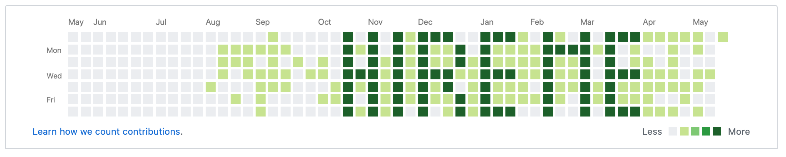

# Hack your Github activity

1. Download the `git_commits.command` file

2. Put it into a local repo of your choice

3. Edit the file (Careful: Double clicking might run it instead of opening it in a text editor)

   1. Point the `cd` command to the right directory
   2. Edit the days you want affected
   3. Edit the number of commits for each day

4. Run it.

5. `git push` the changes to remote repo

6. Wait 2-3 minutes for changes to appear in activity.

7. Repeat for every month

   

